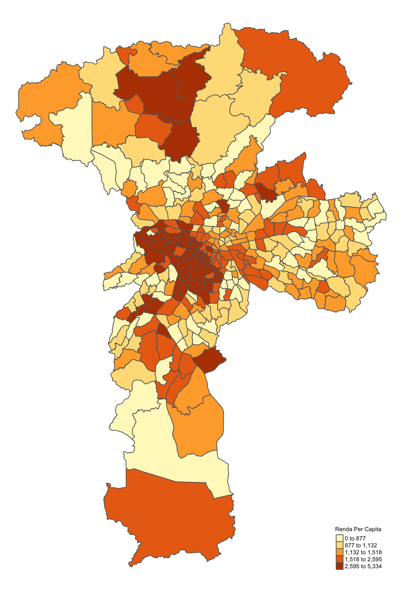

# Índice Árboreo da Cidade de São Paulo
Análise realizada para a live do mestrado em Cidades Inteligentes e Sustentáveis

## Variáveis

* Dependente: Índice de Massa Árboreo
* Independentes: Renda per Capita, Quantidade de Domicílios, Quantidade de Automóveis e Quantidade de Empregos

## Análise

A técnica empregada é a regressão espacial, também chamada de regressão geograficamente ponderada, na qual os coeficientes das variáveis independentes podem variar conforme a localização geográfica da observação

## Resultados

