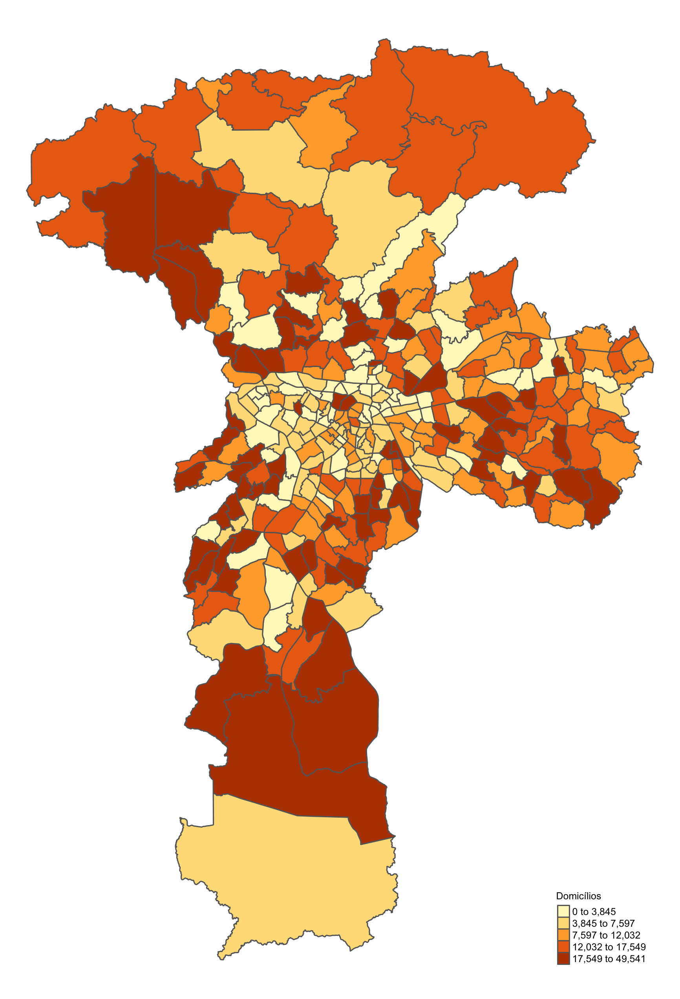

# Índice Arbóreo da Cidade de São Paulo
Análise realizada para a live do mestrado em Cidades Inteligentes e Sustentáveis

## Variáveis

* Dependente: Índice de Massa Árboreo (calculado a partir de imagens de satélite)
* Independentes: Renda per Capita, Quantidade de Domicílios, Quantidade de Automóveis e Quantidade de Empregos (todos obtidos pela pequisa Origem-Destino de 2017)

## Análise

A técnica empregada é a regressão espacial, também chamada de regressão geograficamente ponderada, na qual os coeficientes das variáveis independentes podem variar conforme a localização geográfica da observação

## Resultados

|           | Constante| Renda per Capita| Domicílios| Automóveis|  Empregos|
|:----------|---------:|----------------:|----------:|----------:|---------:|
|Mín        |      0.04|        -0.000288|  -0.000047|  -0.000030| -0.000055|
|1º Quantil |      0.27|        -0.000141|  -0.000015|  -0.000009| -0.000003|
|Mediana    |      0.41|        -0.000055|  -0.000004|   0.000004| -0.000001|
|Média      |      0.41|        -0.000070|  -0.000006|   0.000005| -0.000005|
|3º Quantil |      0.55|         0.000014|   0.000002|   0.000016|  0.000000|
|Máx        |      0.93|         0.000051|   0.000013|   0.000065|  0.000002|
|Global     |      0.35|        -0.000017|  -0.000001|  -0.000002| -0.000003|

{ width=50% }
{ width=50% }
{ width=50% }
{ width=50% }
{ width=50% }
{ width=50% }
